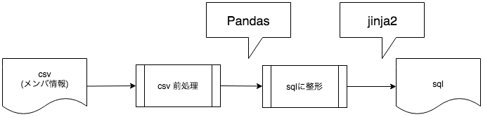
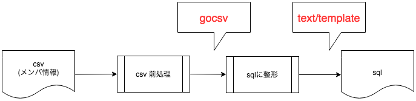

### Python -> Golangで  
### ちょっとしたツールを作り直した

---

### 自己紹介

- @pco2699 FintechスタートアップでJava
- Go歴 : 半年ほど

---


https://sway.com/MYj8aUMJv5dJZk1J?ref=Link&loc=play  
Go合宿行きましたが...

---

### Go一切書いてない

---

### さすがにちょっとくやしい

---

### 急遽、内容変更

---

### 社内で使っていたcsv -> sql ツールをGoで書き直した！！！

---

## 作ったツール
- Pythonで作成  


---

## Goでの構成


---

## [/gocarina/gocsv](https://github.com/gocarina/gocsv)
- jsonパッケージと同じ要領でcsvの内容をstructにマッピングしてくれる
```go
type ClientInfo struct {
	DeleteTarget   string `csv:"削除対象"`
	No             string `csv:"-"`
	FamilyName     string `csv:"姓"`
	Name           string `csv:"名"`
	MailAddress    string `csv:"メールアドレス"`
	DepartmentName string `csv:"部店名"`
}
```

---

## gocsvでUnmarshal
```go
	deleteInfos := []*ClientInfo{}
	if err := gocsv.UnmarshalFile(deleteInfoFile, &deleteInfos); err != nil { // Load clients from file
		log.Fatal(err)
    }
```

---

## Gocsvでのつまりどころ
Excelでcsvを読み書きするとShiftJISなので、読み込み/書き込みの際のCsvReaderは  
ShiftJIS用に置き換える
```go
import (
    "golang.org/x/text/encoding/japanese"
	"golang.org/x/text/transform"
)
func init() {
	gocsv.SetCSVReader(func(in io.Reader) gocsv.CSVReader {
		return csv.NewReader(transform.NewReader(in, japanese.ShiftJIS.NewDecoder()))
	})
}
```

---

## text/htmlでテンプレート書き出し
- テンプレート書き出し用のstructを作って書き出し
```go
	tpl, _ := template.ParseFiles("template.sql")
	data := &TemplateMapping{
		Number:      9999,
		FirstClientInfo: deleteInfos[0],
		ClientInfo:      deleteInfos[1:],
	}
	err = tpl.Execute(file, data)
```

---

## テンプレート側
```sql
declare @SOPERATION nvarchar(255) = 'SOPERATION-{{.Number}}'
;
```
```sql
{{ range $i, $v := .ClientInfo }}
set @LoginUserName = '{{$v.MailAddress}}';
{{ end }}
```

---

## つまりポイント
- structのメンバ名の頭が大文字じゃないとテンプレートに注入されない -> 公開しているか否かが関係してると思われるが理由は不明
- テンプレート側の記法がGoからまるっと違うので、頭を切り替える必要

---

## Python -> Goに書き換えてみた感想
- structでデータ構造を定義でき、それがそのままデータの設計書になるので読みやすい  
  (Pythonだとなんでもホイホイ辞書型に突っ込んでしまうので...)
- たしかにテンプレートエンジンはちょっと微妙かも(jinja2はそのままPythonの記法が使えて便利)

---

# 現場からは以上です